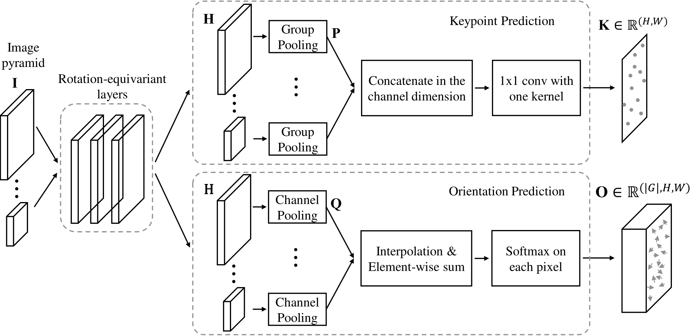
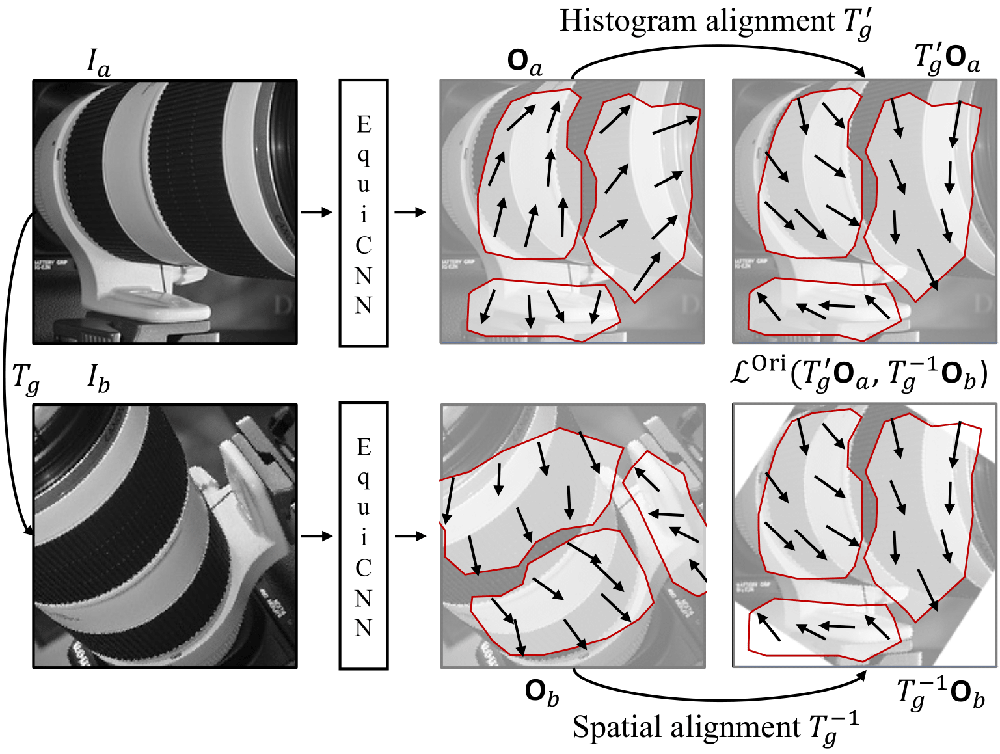

#  Self-Supervised Equivariant Learning for Oriented Keypoint Detection (CVPR 2022)


This is the official implementation of the CVPR 2022 paper "Self-Supervised Equivariant Learning for Oriented Keypoint Detection" by [Jongmin Lee](https://bluedream1121.github.io/), Byungjin Kim, and [Minsu Cho](http://cvlab.postech.ac.kr/~mcho/).


<p float="left">
    
   
</p>

Detecting robust keypoints from an image is an integral part of many computer vision problems, and the characteristic orientation and scale of keypoints play an important role for keypoint description and matching. Existing learning-based methods for keypoint detection rely on standard translation-equivariant CNNs but often fail to detect reliable keypoints against geometric variations. To learn to detect robust oriented keypoints, we introduce a self-supervised learning framework using rotation-equivariant CNNs. We propose a dense orientation alignment loss by an image pair generated by synthetic transformations for training a histogram-based orientation map. Our method outperforms the previous methods on an image matching benchmark and a camera pose estimation benchmark.

## Rotation-equivariant Keypoint Detection 

PyTorch source code for CVPR2022 paper.

```text
"Self-Supervised Equivariant Learning for Oriented Keypoint Detection".
Jongmin Lee, Byungjin Kim, Minsu Cho. CVPR 2022.
```
[[Paper](https://arxiv.org/abs/2204.08613)] [[Project page](http://cvlab.postech.ac.kr/research/REKD/)]


## Installation


#### Clone the Git repository
```bash
git clone https://github.com/bluedream1121/ReKD.git
```

#### Install dependency
Run the script to install all the dependencies. You need to provide the conda install path (e.g. ~/anaconda3) and the name for the created conda environment.

```
bash install.sh [conda_install_path] rekd
```

#### Requirements

* Ubuntu 18.04
* python 3.8
* pytorch 1.8.1
* torchvision 0.9.1
* kornia 0.5.2
* opencv-python 4.5.2.54
* scipy 1.6.3
* e2cnn 0.1.9

## Dataset preparation

#### Training data
- ImageNet 2012 for synthetic dataset generation (6.4G) : [[Download ImageNet2012 validation set](https://academictorrents.com/details/5d6d0df7ed81efd49ca99ea4737e0ae5e3a5f2e5)]

  - But, you don't have to use ImageNet 2012 validation set. Any image sequence can be used for the training, because this framework trains the model by self-supervised manner.

#### Evaluation data
- HPatches sequences (1.2G) [[Download HPatches](http://icvl.ee.ic.ac.uk/vbalnt/hpatches/hpatches-sequences-release.tar.gz)]

  - Please put the ```hpatches-sequences-release/``` to ```datasets/``` directory. 

- IMC2021 validataion set (343M) [[Download IMC2021 validation](https://postechackr-my.sharepoint.com/:u:/g/personal/ljm1121_postech_ac_kr/ER49FXF3809Oofmt-kviyJkBDVwVKXstJ1IN_6KmjurAog?e=ZVNLCM)] [[Original Link](https://www.cs.ubc.ca/research/image-matching-challenge/2021/data/)]

  - Follow to evaluate [this github instruction](https://github.com/ducha-aiki/imc2021-sample-kornia-submission) and [this evaluation benchmark](https://github.com/ubc-vision/image-matching-benchmark).


#### Synthetic data generation 

```python train.py --data_dir [ImageNet_directory] --synth_dir datasets/synth_data --patch_size 192 --max_angle 180```

  * Dataset parameters:

      * data_dir: File containing the image paths for generating synthetic training data.
      * patch_size: The patch size of the generated dataset.
      * max_angle: The max angle value for generating a synthetic view to train.
      * num_training_data: The number of the generated dataset.


- We release the training data that we use to train our model. please download [this link](https://postechackr-my.sharepoint.com/:u:/g/personal/ljm1121_postech_ac_kr/EfXYlEpdG2BDsusiSnsh358BgZPw2WwyXzB7TtWjvuNhrA?e=vRKcKt) (841M) (password : rekd). 
- Please put the folder to ```datasets/``` directory. 


## Training 

``` python train.py --synth_dir datasets/synth_data --group_size 36 --batch_size 16 --ori_loss_balance 100 ```

  * Network Architecture:

      * group_size: The order of group for the group convolution. default=36
      * dim_first: The number of channels of the first layer. default=2
      * dim_second: The number of channels of the second layer. default=2
      * dim_third: The number of channels of the third layer. default=2

## Test on the HPatches

You can download the pretrained weights [[best models](https://postechackr-my.sharepoint.com/:u:/g/personal/ljm1121_postech_ac_kr/EXvKPAR3p7pOiN9fiG1E-7kBrJapaYvRKJqXKWMT3h4k5g?e=JFTWHn)] (password : rekd)


``` python eval_with_extract.py --load_dir [Trained_models] --eval_split full ```

  * descriptor: File containing the image paths for extracting features.
  * exp_name: The output path to save the extracted features to this directory: ```extracted_features/[exp_name]```
  * num_points: The number of desired features to extract. Default: 1500.
  * pyramid_levels: downsampling pyramid levels.
  * upsampled_level: upsampling image levels.
  * nms_size: window size of non-maximal suppression.


<details>
<summary><b>HPatches all variations</b></summary> 


Results on HPatches all variations. `*' denotes the results with outlier filtering using the orientation. We use [HardNet](https://github.com/DagnyT/hardnet) descriptor for evaluation.

|          Model         |  Repeatability | MMA@3 | MMA@5 |  pred. match. |                                            Links                       | Notes                    |
|:----------------------:|:-----:|:-------:|:-----:|:-------:|:-------------------------------------------------------------------------------------------:|--------------------------|
| CVPR2022               | 57.6 | 73.1   | 79.6 | 505.8 | -                                                                                           | CVPR2022 results         |
| CVPR2022*               | 57.6 | 76.7   | 82.3 | 440.1 | -                                                                                           | CVPR2022 results         |
| REKD_release | 58.4 |  73.5  |  80.1   | 511.6 |  [model](https://postechackr-my.sharepoint.com/:u:/g/personal/ljm1121_postech_ac_kr/EXvKPAR3p7pOiN9fiG1E-7kBrJapaYvRKJqXKWMT3h4k5g?e=JFTWHn) | Official retrained model |
| REKD_release* | 58.4 |  77.1  | 82.9 |  444.4 |  [model](https://postechackr-my.sharepoint.com/:u:/g/personal/ljm1121_postech_ac_kr/EXvKPAR3p7pOiN9fiG1E-7kBrJapaYvRKJqXKWMT3h4k5g?e=JFTWHn) | Official retrained model |


```bash 
python eval_with_extract.py --load_dir trained_models/release_group36_f2_s2_t2.log/best_model.pt --eval_split full
```


</details>


<details>
<summary><b>HPatches viewpoint variations</b></summary> 

Results on HPatches  viewpoint variations. `*' denotes the results with outlier filtering using the orientation. We use [HardNet](https://github.com/DagnyT/hardnet) descriptor for evaluation.

|          Model         |  Repeatability | MMA@3 | MMA@5 |  pred. match. |    Notes                    |
|:----------------------:|:-----:|:-------:|:-----:|:-------:|:--------------------------|
| REKD_release | 59.1 |  72.5  |  78.7   |  464.9  | Official retrained model |
| REKD_release* | 59.1 |  75.7  | 81.1 |  399.8  | Official retrained model |

</details>


<details>
<summary><b>HPatches illumination variations</b></summary> 

Results on HPatches illumination variations. `*' denotes the results with outlier filtering using the orientation. We use [HardNet](https://github.com/DagnyT/hardnet) descriptor for evaluation.


|          Model         |  Repeatability | MMA@3 | MMA@5 |  pred. match. |    Notes                    |
|:----------------------:|:-----:|:-------:|:-----:|:-------:|:--------------------------|
| REKD_release | 57.6 |  74.4  |   81.5  |  559.9  | Official retrained model |
| REKD_release* | 57.6 | 78.5   | 84.7 | 490.6   | Official retrained model |

</details>


## Citation
If you find our code or paper useful to your research work, please consider citing our work using the following bibtex:
```
@inproceedings{lee2022self,
  title={Self-Supervised Equivariant Learning for Oriented Keypoint Detection},
  author={Lee, Jongmin and Kim, Byungjin and Cho, Minsu},
  booktitle={2022 IEEE/CVF Conference on Computer Vision and Pattern Recognition (CVPR)},
  pages={4837--4847},
  year={2022},
  organization={IEEE}
}
```

## Reference
  * [Key.Net: Keypoint Detection by Handcrafted and Learned CNN Filters](https://github.com/axelBarroso/Key.Net) (ICCV 2019)
  * [Self-Supervised Learning of Image Scale and Orientation Estimation](https://github.com/bluedream1121/self-sca-ori) (BMVC 2021)
  * [Working hard to know your neighbor's margins: Local descriptor learning loss](https://github.com/DagnyT/hardnet) (NIPS 2017)

## Contact

Questions can be left as issues in the repository. 
